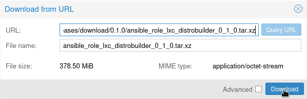

LXC - DISTROBUILDER
============
I've always wished for something like a Dockerfile, but for LXC containers. Recently, I discovered [distrobuilder](https://linuxcontainers.org/distrobuilder/docs/latest/), a tool that allows you to effortlessly create LXC containers using a YAML configuration. With this in mind, I've wrapped it into an Ansible playbook and set up GitHub Actions to provide semi-automated LXC container provisioning!

## 🔨 TODO

- [x] Packages
- [x] Scripts
- [ ] Files
- [ ] Actions Packages
- [ ] Actions File
- [ ] Variants
- [ ] Releases

## Table of Contents
- [Refs](#-refs)
- [Requirements](#-requirements)
- [Quick start](#%EF%B8%8F-quick-start)
- [Playbook Options](#-playbook-options)
- [Makefile stages](#-make-stages)
- [Repository structure](#-repository-structure)
- [Versioning model](#-versioning-model)
- [Proxmox](#proxmox)

## 📌 Refs
<sup>[(Back to top)](#table-of-contents)</sup>

- https://linuxcontainers.org/distrobuilder/docs/latest/reference/source/
- https://blog.simos.info/using-distrobuilder-to-create-container-images-for-lxc-and-lxd/
- https://github.com/lxc/lxc-ci/blob/main/images/debian.yaml

## 🧰 Requirements
<sup>[(Back to top)](#table-of-contents)</sup>

Make sure you have installed both - latest docker and gnu make!

  - `Docker` - https://docs.docker.com/desktop/install/
  - `Make` - https://ftp.gnu.org/gnu/make/

## ⚡️ Quick start
<sup>[(Back to top)](#table-of-contents)</sup>

  1. Clone repository
  2. execute `make prepare`

## 📔 Playbook Options
<sup>[(Back to top)](#table-of-contents)</sup>

#### playbook
```yml
#!/usr/bin/env ansible-playbook
#---
- name: playbook 
  hosts: localhost 

  roles:
    - role: distrobuilder

      # Additional packages 
      packages:
      - curl
      - vim-tiny
      
      # Additional scripts 
      actions:
      - | 
        #!/bin/sh
        # Install docker engine
        set -eux
        curl -fsSL https://get.docker.com | sh
      - |
        #!/bin/sh
        # ...
...
```

## 📒 Make stages
<sup>[(Back to top)](#table-of-contents)</sup>

Stages definied in makefile.

- `make prepare` - Execute `ansible-playbook`,
- `make execute` - Execute `distrobuilder`,
- `make show` - Show running containers,
- `make prune` - Prune project related containers,

## 🗄 Repository structure
<sup>[(Back to top)](#table-of-contents)</sup>

- `./ansible` ansible related resources, workdir for compose-containers,
- `./build` each step contains its own docker container,
- `./Makefile` entrypoint.

## 🔖 Versioning model
<sup>[(Back to top)](#table-of-contents)</sup>

Versions have the format `<MAJOR>.<MINOR>(.<PATCH>)?` where:

- `<MAJOR>` Triggered manualy from default branch,
- `<MINOR>` Triggered automaticly after each push from default branch,
- `<PATCH>` Triggered automaticly after each push from fix/[0-9].[0-9].x branch.

## Proxmox
<sup>[(Back to top)](#table-of-contents)</sup>

Here's a brief showcase demonstrating how we can populate our built artifact into Proxmox PVE!

<p align="center">

</p>
<p align="center">

</p>
<p align="center">

</p>
